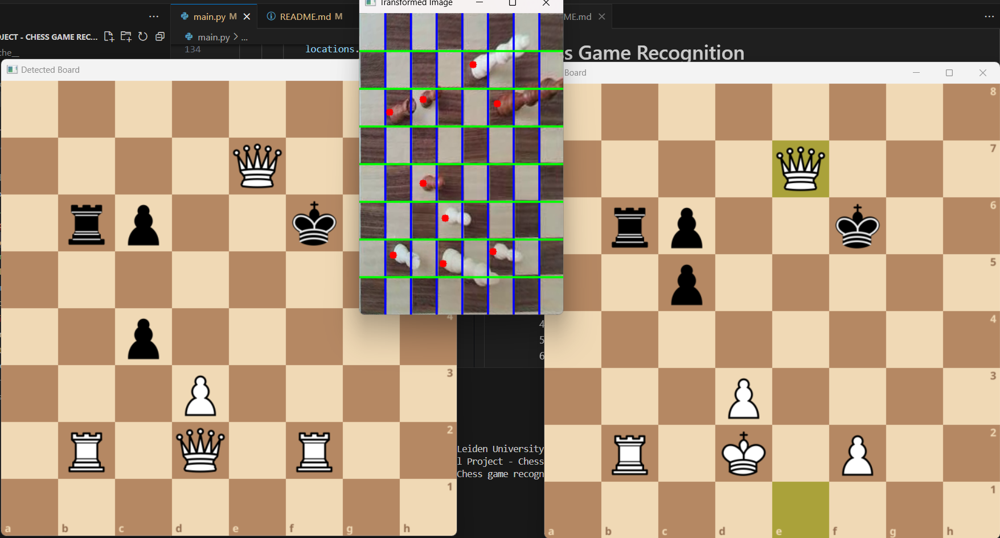

# Chess Game Recognition
:triangular_flag_on_post: The goal of this project is to be able to do a live demonstration where we regocnise the pieces on a chess board and their location using your phone camera. This can be devided into three sub goals:
1. At least chess game reconstruction with a single camera from a fixed position.
2. Chess game reconstruction from multiple angels.
3. Free-hand video chess game reconstruction. :white_check_mark: for endgame situations

## Approach
The program takes the follwing steps to convert the video frame to the chess board representation:
1. Take 1 out of every n frames (n = `frames_to_skip`)
2. Size frame down to 640x480
3. Use retrained yolov8n model to detect corners
4. Use retrained yolov8s model to detect pieces
5. Convert image to topdown view of chess board only
6. Devide the topdown image in 8 equaly sized rows and columns
7. Use transformation matrix from step 5 to get predictions locations from step 4 in the topdown view
8. Use grid from step 6 to get the locations (a1, a2,... h7, h8) of the chess pieces
9. Create FEN string
10. Use FEN string to detect legal moves (stops wrong predictions from impacting performance)
11. Update current chess board accordingly


## Requirements 
All the requirements for this project are listed in the requirements.txt file. These packages can be intalled using `pip install -r requirements.txt`.

## Live Camera feed
In order to use the camera feed from your phone you have to follow the following steps:
1. Download an app such as "IP Webcam" for Android or "iVCam" for iOS and Windows
2. Start a stream in the "IP Webcam app"
3. Change the location in the helper.get_ip() fuction (make sure the location is added in the helper.py file, or change the url directly)
```python
import helper

video_feed_url = helper.get_ip('home')
cap = cv2.VideoCapture(video_feed_url)
```
or
```python
import helper

video_feed_url = "https:// ... /video" # add your ip adress
cap = cv2.VideoCapture(video_feed_url)
```
### Video input
You can also use video input to run/test the program. This can be done by using the following code:
```python

video_path = 'test_videos/VIDM4.mp4'  
cap = cv2.VideoCapture(video_path)
```
Code will performe well on test_videos/VID1.mp4, test_videos/VID2.mp4 and test_videos/VIDM4.mp4. The other test videos cause trouble for step 3 and 4 of the program. 

## Training Process
The training set consists of images from multiple angles in multiple lighting conditions. The chessboard used is: https://www.bol.com/nl/nl/p/sincer-magnetisch-schaakset/9300000169267633/?s2a=&bltgh=gP9quxkqp-zszO3Jx3dGSg.2_35_36.37.FeatureOptionButton#productTitle. 

### Corner dataset
The annotated data set for the corners can be accesed via the following link: https://universe.roboflow.com/uni-d5gj3/chess-corner-points

<a href="https://universe.roboflow.com/uni-d5gj3/chess-corner-points">
    </img>
</a>

### Pieces dataset
The annotated data set for the chess pieces can be accesed via the following link: https://universe.roboflow.com/uni-d5gj3/chess-piece-normal

<a href="https://universe.roboflow.com/uni-d5gj3/chess-piece-normal">
    </img>
</a>

## Run Instructions
1. Set up a chess board with 1 King, 1 Queen, 1 Rook and 2 pawns for both black and white. 
2. Once video feed is initiated run `main.py`. 
3. Start filming from 'a' or '1' side of the chess board
4. In the standard configuration, as seen in commit named "Updated File Structure - Demo Version Full", the program should show the topdown view with grid and red dots indicating a predicted piece once we have detected four corners of a chessboard (middle window). It shows 2 chessboards ones a valid initial state is found. The window called "Detected Board" shows the predictions of the current frame (left window). This window will show some flikkering as predictions are not fully accurate all of the time as can be seen in the image below. The window called "Board" will shows the current accepted board with highlights for the last move (right window). 



## Inspiration technical approach
- James Gallagher. (Mar 10, 2023). Represent Chess Boards Digitally with Computer Vision. Roboflow Blog: https://blog.roboflow.com/chess-boards/

## Future Work
This section describes possible improvements that can be made to the project:

1. Ability to track a chess game from the start
2. Enhance dataset to be more robust (more chess boards, more lighting situations, more angels)
3. Track orientation of chess board regardless of camera positioning (allow for filming from 'h' and '8' side of the chess board)
4. Add move suggestion / integration with some chess engine
5. Improve gitHub page for ease of use